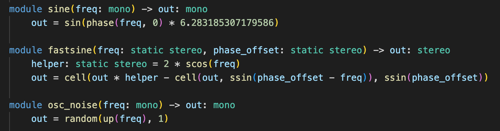
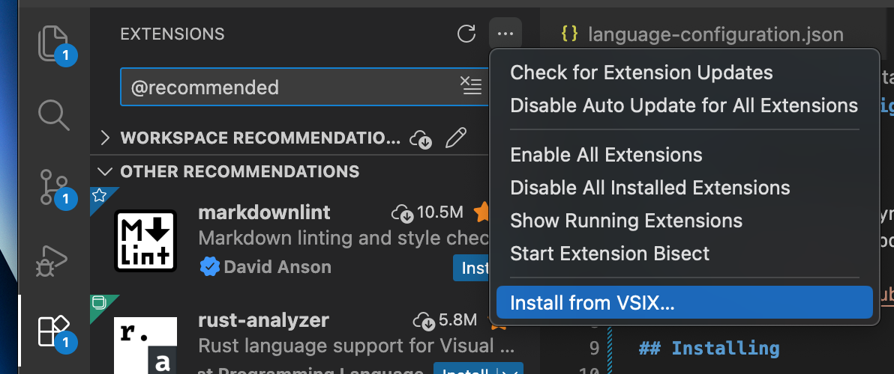

# Jingler Syntax Highlighting for Visual Studio Code README

## About

This extension provides syntax highlighting for the Zing language used in Jingler. It is compatible with Visual Studio Code and derived editors, such as Google Antigravity, Codium, Cursor, and more.

The extension also provides symbol definition information. VS Code functionality such as Go to Definition, Peek Definition etc. also work.

## Installing

Install the Jingler syntax highlighting extension by navigating to the [Release Page](https://github.com/askeksa/Jingler-syntax/releases) and downloading the latest `.vsix` file.

In the editor, go to the extensions page, click the three dots, select **Install from VSIX...** and select the file you downloaded.

